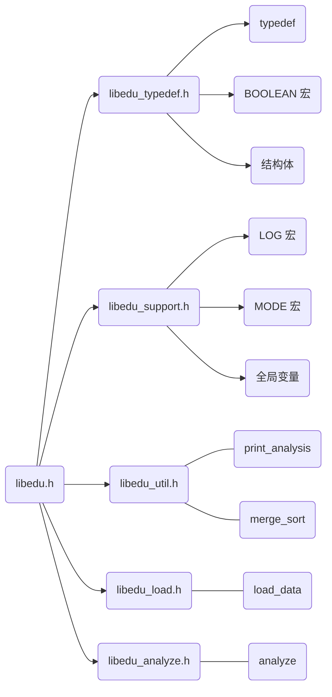
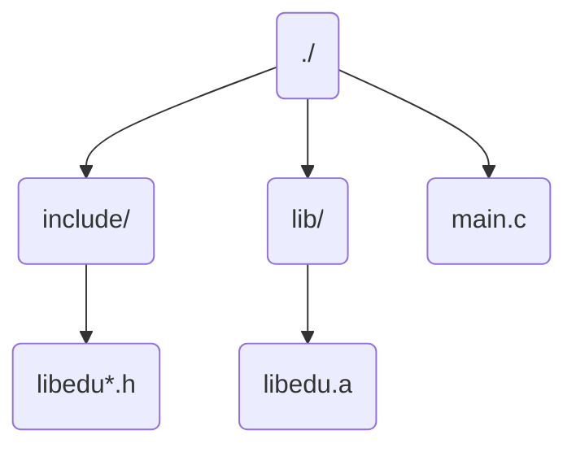
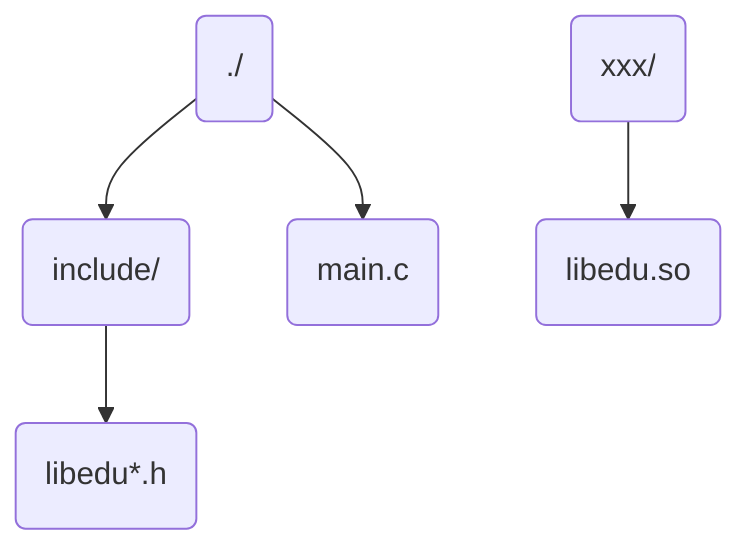

## 结构图



## 主要类型及函数

| 类型       | 名称             | 描述                                                         |
| ---------- | ---------------- | ------------------------------------------------------------ |
| `type`     | `Claz`           | 储存班级信息                                                 |
| `type`     | `Course`         | 储存课程信息                                                 |
| `type`     | `Student`        | 储存学生信息                                                 |
| `type`     | `analysis_p`     | 实为 `void*`，专门用来指向 `Claz`、`Course`、`Student`       |
| `type`     | `mode`           | 选择函数进行操作                                             |
| `type`     | `analysis_t`     | 告知函数传入的参数类型（对象通过 `void*` 传入）              |
| `type`     | `analysis`       | 储存分析的数据                                               |
| `function` | `load_data`      | 通过传入的的文件名加载数据                                   |
| `function` | `analyze`        | 分析数据，需要传入对象及其类型，并指定进行的操作，返回 `analysis` 指针 |
| `function` | `print_analysis` | 传入 `analysis` 指针，指定数据类型，格式化打印数据           |

## 输入数据模板

```
claz_num
claz_id claz_name student_num
...

course_num
course_id course_name credit is_core student_num
...

student_num
student_id student_name claz_id course_num
course_id course_score
...

...
```

注释版：

```
// 这是注释，只是在这里用来讲解，不应该出现在文件中
// 以空白符进行分隔，换行不影响读取
// 班级数（unsigned）
claz_num
// 班级编号（16 Byte） 班级名称（32 Byte) 班级内学生数
claz_id claz_name student_num
// 如果 claz_num > 1 则应当还有数据
...

// 课程数（unsigned）
course_num
// 课程编号（16 Byte） 课程名称（32 Byte) 学分数（unsigned） 是否为核心课程（int） 选课学生数
course_id course_name credit is_core student_num
// 如果 course_num > 1 则应当还有数据
...

// 学生数（unsigned）
student_num
// 学生学号 学生姓名 所属班级编号（16 Byte） 选课数（unsigned）
student_id student_name claz_id course_num
// 该学生选课的课程编号 课程分数
course_id course_score
// course_num > 1 则应当还有数据
...
// 此处输入完一个学生

// 以下当 student_num > 1 则应当还有数据
...
```

示例：

```
2
2018260103 软件1803 1
2018260104 软件1804 1

2
Course_A Course_A 1 1 2
Course_B Course_B 4 1 1

2
201826010301 Student_A1 2018260103 2
Course_A 99.5
Course_B 45.6

201826010401 Student_B1 2018260103 1
Course_A 84.1
```

## 静态库

### 生成静态库

```shell
gcc -c libedu_util.c libedu_load.c libedu_analyze.c
gcc -c *.c
# 生成 libedu_util.o libedu_load.o libedu_analyze.o

ar -crv libdeu.a libedu_util.o libedu_load.o libedu_analyze.o
ar -crv libedu.o *.o
# 生成静态库 libdeu.a
```

### 使用静态库

#### 目录结构



#### main.c

```c
/* main */
#include "libedu.h"
/* ... */
```

#### 编译/连接

```shell
gcc -o main main.c -I include -L lib -l edu
gcc -o main main.c -I include -ldl lib/libedu.a
# 文件大小 20875 Byte
```

- `-I`：指定 `include` 目录，查找优先级低于直接查找
- `-L`：指定 `lib` 目录，配合 `-l` 使用
- `-l`：指定静态库文件，省略开头的 `lib` 和末尾的 `.a`
- `-ldl`：指定文件位置

## 动态库

### 生成动态库

```shell
gcc -fPIC -shared -o libedu.so *.c
```

- `-fPIC`：目标文件全部使用相对地址（ `position independent code` ）

不指定 `-fPIC` 则在每次加载动态库的时候都需要重定位，需要修改代码段，导致代码段的 `copy`。

有时 `gcc` 会默认带上 `-fPIC` ，有时会融合在别的选项里，最好显式指定。

### 使用动态库

#### 目录结构



#### main.c

```c
/* main */
#include <dlfcn.h>
#include "libedu.h"

int main()
{
    // 显式加载动态库
    // RTLD_NOW 加载所有未定义的符号
    // RTLD_LAZY 不加载未定义的符号，需要通过 dlsym 显式加载
    void* dl = dlopen("libedu.so", RTLD_NOW);
    /* ... */
}
```

#### 编译/连接

```shell
gcc -o main main.c -I include -l edu -ldl
# 文件大小 7514 Byte
```

- `-ldl`：指定文件路径，不存在则从环境加载
  - 将动态库路径添加至 `/etc/ld.so.conf`
  - 或将动态库路径添加为环境变量 `LD_LIBRARY_PATH`

```
# cat /etc/ld.so.conf
# 查看文件里有什么
include /etc/ld.so.conf.d/*.conf

# vim /etc/ld.so.conf.d/usrlibs.conf
# 新建一个 .conf 文件
/usr/local/lib

# ldconfig
# 重新加载配置
```

## 开源链接

用于练手的一个小项目，可能会存在一些 bug，但我觉得更重要的是保持良好的规范。

[https://github.com/WilfredShen/libedu](https://github.com/WilfredShen/libedu)
